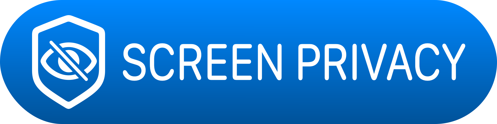

# ScreenPrivacy

[English](../README.md) 🇬🇧 | [Italiano](README.it.md) 🇮🇹 | [Español](README.es.md) 🇪🇸 | [Français](README.fr.md) 🇫🇷 | [Deutsch](README.de.md) 🇩🇪 | [Русский](README.ru.md) 🇷🇺

`ScreenPrivacy` es un paquete SwiftUI para ocultar pantallas sensibles cuando tu app pasa a estar inactiva y, de forma opcional, cuando se detecta una captura de pantalla. Aplica `privacySensitive()` al contenido protegido y puede envolver ese contenido en un contenedor seguro basado en UIKit cuando el bloqueo de captura está activado.

## Acerca Del Paquete

Usa `ScreenPrivacy` cuando una vista no deba seguir visible ni en los snapshots del app switcher ni durante una captura activa. El paquete mantiene una integración sencilla:

- Aplica un único modificador de vista para el caso más común.
- Cambia a un contenedor cuando la composición encaja mejor en tu árbol de vistas.
- Mantén el escudo por defecto o proporciona tu propia vista de protección.
- Desactiva la detección de captura si solo te importa el escudo para escenas inactivas.

## Instalación

Añade `ScreenPrivacy` como dependencia de Swift Package en Xcode, o refiérelo desde `Package.swift` durante el desarrollo local:

```swift
dependencies: [
    .package(path: "../Packages/ScreenPrivacy")
]
```

Después impórtalo en cualquier archivo SwiftUI que necesite protección:

```swift
import ScreenPrivacy
import SwiftUI
```

## Inicio Rápido

La integración mínima útil es el modificador:

```swift
struct AccountView: View {
    var body: some View {
        AccountDetailsView()
            .screenPrivacyShield()
    }
}
```

Esto usa el escudo por defecto, activa la detección de captura y habilita el renderizado seguro por defecto.

## Uso

Usa un escudo personalizado cuando la interfaz alternativa deba coincidir con el lenguaje de tu producto:

```swift
struct AccountView: View {
    var body: some View {
        AccountDetailsView()
            .screenPrivacyShield {
                VStack(spacing: 12) {
                    Image(systemName: "lock.shield")
                        .symbolRenderingMode(.hierarchical)
                        .imageScale(.large)
                        .font(.largeTitle)

                    Text("Privado")
                        .font(.title2)
                        .bold()

                    Text("Oculto mientras esta pantalla no sea segura para mostrarse.")
                        .font(.subheadline)
                }
                .frame(maxWidth: .infinity, maxHeight: .infinity)
                .background(.background)
                .foregroundStyle(.primary)
            }
    }
}
```

Si prefieres composición en lugar de un modificador, usa `ScreenPrivacyContainer`:

```swift
struct AccountView: View {
    var body: some View {
        ScreenPrivacyContainer {
            AccountDetailsView()
        }
    }
}
```

## Configuración

`ScreenPrivacy` expone tres controles en tiempo de ejecución:

| Opción | Valor por defecto | Efecto |
| --- | --- | --- |
| `isEnabled` | `true` | Activa o desactiva el escudo de privacidad. |
| `includeCaptureDetection` | `true` | Muestra el escudo cuando la pantalla está siendo capturada. |
| `blocksScreenCapture` | `true` | Envuelve el contenido en el contenedor seguro usado por el paquete en plataformas UIKit. |

Ejemplo:

```swift
struct AccountView: View {
    var body: some View {
        AccountDetailsView()
            .screenPrivacyShield(
                isEnabled: true,
                includeCaptureDetection: false,
                blocksScreenCapture: true
            )
    }
}
```

## Comportamiento

Las reglas de visibilidad del paquete son intencionadamente pequeñas:

- Si la protección está desactivada, el escudo permanece oculto.
- Si la escena pasa a estar inactiva, el escudo se muestra.
- Si la detección de captura está activada y la pantalla está siendo capturada, el escudo se muestra.
- El contenido protegido se marca con `privacySensitive()`.
- La presentación del escudo usa una transición de opacidad.

En plataformas UIKit, el renderizado seguro se implementa con un contenedor respaldado por un campo de texto seguro. En entornos donde UIKit no está disponible, el paquete recurre a un wrapper SwiftUI normal.

## Cuándo Usarlo

`ScreenPrivacy` encaja bien en pantallas como:

- saldos de cuenta o detalles de pago
- datos de salud o bienestar
- notas privadas, diarios o mensajes
- dashboards internos o herramientas operativas

## Requisitos

- iOS 17.0 o posterior
- macOS 14.0 o posterior
- Swift 6.0 o posterior

Estos valores coinciden con el `Package.swift` incluido en el repositorio.

## Estructura Del Paquete

```text
ScreenPrivacy/
├── Sources/ScreenPrivacy/
│   ├── ScreenPrivacy.swift
│   ├── ScreenPrivacyContainer.swift
│   ├── ScreenPrivacyShieldModifier.swift
│   ├── ScreenPrivacyMonitor.swift
│   ├── SecureContentView.swift
│   └── DefaultScreenPrivacyShieldView.swift
├── Tests/ScreenPrivacyTests/
├── Docs/
└── Package.swift
```

## Tests

El paquete incluye cobertura con Swift Testing para:

- protección en escenas inactivas
- protección activada por captura
- recálculo al activar y desactivar
- activación y desactivación de la detección de captura
- proveedores inyectados del estado de captura

## Licencia

[MIT](../LICENSE)
