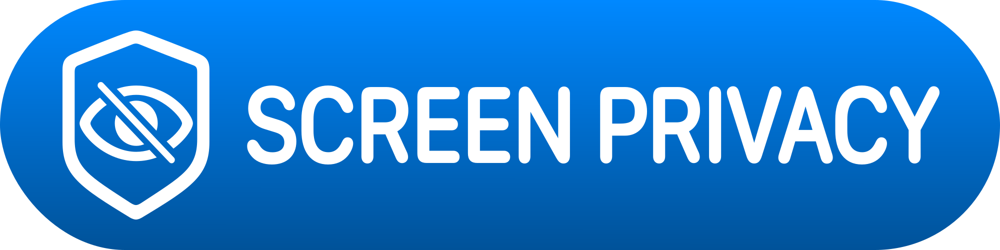

# ScreenPrivacy

[English](../README.md) 🇬🇧 | [Italiano](README.it.md) 🇮🇹 | [Español](README.es.md) 🇪🇸 | [Français](README.fr.md) 🇫🇷 | [Deutsch](README.de.md) 🇩🇪 | [Русский](README.ru.md) 🇷🇺

Защитите чувствительные экраны SwiftUI с помощью экрана приватности, который появляется, когда приложение становится неактивным, и, при необходимости, когда обнаружен захват экрана. `ScreenPrivacy` также применяет `privacySensitive()` и может размещать защищённый контент внутри безопасного контейнера, чтобы усложнить скриншоты и записи экрана.

## Почему ScreenPrivacy

- Защита чувствительных SwiftUI-представлений одной строкой.
- Безопасные снимки в app switcher благодаря защите при неактивной сцене.
- Опциональное обнаружение захвата как дополнительный уровень поверх поведения при неактивности.
- Кастомный экран, если вам нужны собственные сообщения или визуальный стиль.
- Небольшой публичный API с входом как через модификатор, так и через контейнер.

## Содержание

- [Требования](#требования)
- [Установка](#установка)
- [Быстрый Старт](#быстрый-старт)
- [Настройка](#настройка)
- [Поведение](#поведение)
- [Когда Использовать](#когда-использовать)
- [Структура Пакета](#структура-пакета)
- [Тесты](#тесты)
- [FAQ](#faq)
- [Лицензия](#лицензия)

## Требования

- iOS 17.0 или новее
- macOS 14.0 или новее
- Swift 6.0 или новее

Эти требования соответствуют `Package.swift` в репозитории.

## Установка

Добавьте `ScreenPrivacy` как зависимость Swift Package в Xcode или в `Package.swift`:

```swift
dependencies: [
    .package(path: "../Packages/ScreenPrivacy")
]
```

Затем импортируйте модуль там, где нужно защитить представление:

```swift
import ScreenPrivacy
import SwiftUI
```

## Быстрый Старт

Модификатор по умолчанию предназначен для самого быстрого подключения:

```swift
struct AccountView: View {
    var body: some View {
        AccountDetailsView()
            .screenPrivacyShield()
    }
}
```

### Кастомный Экран

Используйте собственный экран, если хотите управлять тоном, цветами или компоновкой:

```swift
struct AccountView: View {
    var body: some View {
        AccountDetailsView()
            .screenPrivacyShield {
                VStack(spacing: 12) {
                    Image(systemName: "lock.shield")
                        .symbolRenderingMode(.hierarchical)
                        .imageScale(.large)
                        .font(.largeTitle)

                    Text("Приватно")
                        .font(.title2)
                        .bold()

                    Text("Скрыто, пока этот экран небезопасно показывать.")
                        .font(.subheadline)
                }
                .frame(maxWidth: .infinity, maxHeight: .infinity)
                .background(.background)
                .foregroundStyle(.primary)
            }
    }
}
```

### API С Контейнером

Если вы предпочитаете композицию вместо модификаторов:

```swift
struct AccountView: View {
    var body: some View {
        ScreenPrivacyContainer {
            AccountDetailsView()
        }
    }
}
```

## Настройка

`ScreenPrivacy` сохраняет API компактным:

| Опция | Значение по умолчанию | Назначение |
| --- | --- | --- |
| `isEnabled` | `true` | Включает или отключает поведение экрана. |
| `includeCaptureDetection` | `true` | Добавляет защиту при захвате поверх защиты по неактивности. |
| `blocksScreenCapture` | `true` | Использует безопасный контейнер, чтобы усложнить скриншоты и записи. |

Пример с явной конфигурацией:

```swift
struct AccountView: View {
    var body: some View {
        AccountDetailsView()
            .screenPrivacyShield(
                isEnabled: true,
                includeCaptureDetection: false,
                blocksScreenCapture: true
            )
    }
}
```

## Поведение

- Показывает экран, когда сцена становится неактивной.
- Также может показывать экран при обнаружении захвата экрана.
- Применяет `privacySensitive()` к защищённому контенту.
- Использует безопасный контейнер на основе текстового поля, когда `blocksScreenCapture` включён на платформах UIKit.
- Анимирует появление экрана через переход по непрозрачности.
- Использует обычную SwiftUI-обёртку, когда UIKit недоступен во время host-side тестов.

## Когда Использовать

`ScreenPrivacy` хорошо подходит, если ваше приложение показывает:

- балансы или платёжные данные
- данные о здоровье или благополучии
- личные заметки, дневники или сообщения
- внутренние дашборды или операционные инструменты
- всё, что не должно попадать в снимки app switcher

## Структура Пакета

```text
ScreenPrivacy/
├── Sources/ScreenPrivacy/
│   ├── ScreenPrivacy.swift
│   ├── ScreenPrivacyContainer.swift
│   ├── ScreenPrivacyShieldModifier.swift
│   ├── ScreenPrivacyMonitor.swift
│   ├── SecureContentView.swift
│   └── DefaultScreenPrivacyShieldView.swift
├── Tests/ScreenPrivacyTests/
├── Docs/
└── Package.swift
```

## Тесты

Пакет включает покрытие на Swift Testing для основных правил видимости и поведения монитора, включая:

- защиту при неактивной сцене
- защиту, срабатывающую при захвате экрана
- пересчёт при включении или выключении защиты
- включение и выключение обнаружения захвата
- внедряемые провайдеры состояния захвата

## FAQ

**Блокирует ли это снимки экрана?**  
По умолчанию пакет усложняет скриншоты и записи, размещая защищённый контент внутри безопасного контейнера, когда `blocksScreenCapture` равен `true`.

**Работает ли это в виджетах или расширениях?**  
Пакет предназначен для SwiftUI-представлений внутри приложения. Таймлайны виджетов не входят в область поддержки.

**Можно ли добавить аналитику или логирование?**  
Да. Вы можете обернуть `ScreenPrivacyContainer` или защищённый экран собственной логикой жизненного цикла, не меняя API пакета.

**Стоит ли всегда держать обнаружение захвата включённым?**  
Обычно да. Но если вашему продукту нужна только приватность в app switcher, установите `includeCaptureDetection` в `false`.

## Лицензия

[MIT](../LICENSE)
